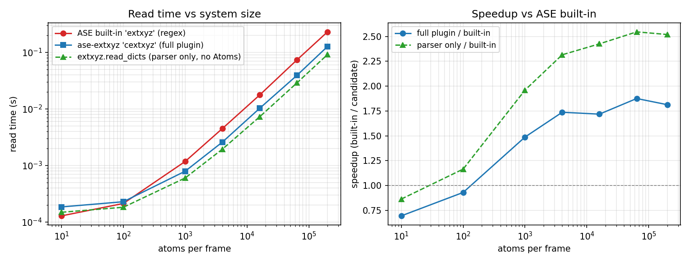

# Extended XYZ specification and parsing tools

This repository contains a specification of the extended XYZ (extxyz) file format, and tools for reading and writing to it from programs written in C, Fortran, Python and Julia.

> **Using ASE?** As of v0.3.0, `extxyz` is the standalone C parser with no
> ASE dependency, and a separate [`ase-extxyz`](python/ase-extxyz/) package
> registers it as an ASE I/O plugin. Install both with
> `pip install ase-extxyz` and use `ase.io.read("file.xyz", format="cextxyz")`.

# Installation

## Python

The latest development version can be installed via

```bash
pip install git+https://github.com/libAtoms/extxyz
```

This requires Python 3.10+ and a working C compiler, plus the PCRE2 and libcleri libraries. `libcleri` is included here as a submodule and will be compiled automatically, but you may need to install PCRE2 with something similar to one of the following commands.

```
brew install pcre2          # macOS with Homebrew
sudo apt-get install libpcre2-dev   # Ubuntu / Debian
vcpkg install pcre2:x64-windows     # Windows (via vcpkg)
```

Binary wheels for Linux, macOS (arm64 and x86_64), and Windows are built in the GitHub CI for each tagged [release](https://github.com/libAtoms/extxyz/releases) and bundle PCRE2 and libcleri, so an end-user `pip install extxyz` does not need either system library.

Stable releases are made to PyPI, so you can install with

```bash
pip install extxyz                # standalone parser, no ASE
pip install ase-extxyz            # ASE plugin (pulls in extxyz + ase)
```

The Python API on `extxyz` itself is the dict/array based `Frame` parser:

```python
import extxyz
for frame in extxyz.iread_dicts('trajectory.xyz'):
    print(frame.natoms, frame.cell, list(frame.arrays))
```

For ASE-aware reading/writing see the [`ase-extxyz`](python/ase-extxyz/) sibling package.

## Performance: cextxyz vs ASE built-in `extxyz` reader

ASE already ships a regex-based `extxyz` reader. The `cextxyz` plugin
re-parses with the libcleri-based C grammar, with PCRE2 JIT
compilation enabled on the per-atom data regex (`PCRE2_JIT_COMPLETE`
+ `PCRE2_ANCHORED`).

Benchmark on a single-frame file with `N` Cu atoms (positions,
forces, and a couple of `info` keys):

| atoms / frame | file size | ASE built-in `extxyz` | `cextxyz` plugin | `extxyz.read_dicts` (no Atoms) | speedup, plugin / built-in | speedup, parser / built-in |
|--:|--:|--:|--:|--:|--:|--:|
|     10 |   0.00 MB | 0.124 ms | 0.178 ms | 0.144 ms | 0.70× | 0.86× |
|    100 |   0.01 MB | 0.207 ms | 0.222 ms | 0.177 ms | 0.93× | 1.17× |
|  1 000 |   0.11 MB | 1.249 ms | 0.838 ms | 0.638 ms | 1.49× | 1.96× |
|  4 000 |   0.44 MB | 4.490 ms | 2.585 ms | 1.937 ms | 1.74× | 2.32× |
| 16 000 |   1.74 MB | 17.6 ms  | 10.2 ms  |  7.25 ms | 1.72× | 2.43× |
| 64 000 |   6.98 MB | 73.4 ms  | 39.1 ms  | 28.8 ms  | 1.88× | 2.55× |
|200 000 |  21.80 MB |230.1 ms  |126.9 ms  | 91.3 ms  | 1.81× | 2.52× |



Below ~100 atoms per frame the per-call setup (file open, PCRE2 JIT
compile, libcleri grammar walk for the comment line) is larger than
the regex match itself, so the built-in is faster on tiny files. From
~1 000 atoms upwards the parser dominates and `cextxyz` runs at a
steady ~1.85× over the built-in end-to-end (~2.5× for the parser
alone). The gap between the two cextxyz curves is the
`Frame → Atoms` translation in the ASE plugin layer, which is
roughly proportional to atom count and unavoidable when an `Atoms`
object is the contract.

The big lever was PCRE2 JIT (`pcre2_jit_compile(re,
PCRE2_JIT_COMPLETE)` after `pcre2_compile`); a `sample`-based profile
attributed ~38 % of CPU to the per-atom `pcre2_match` before JIT.
Enabling JIT on the comment-line grammar (libcleri) is a follow-up
that requires an upstream patch; expected to help mostly on files
with many small frames and rich `info` dicts.

Reproduce locally (requires `extxyz`, `ase-extxyz`, `ase`, `matplotlib`):

```bash
python benchmarks/bench_read.py --max-atoms 200000 --repeats 3
python benchmarks/plot_bench.py
```

## `libextxyz` C library and standalone executables

The C parser, the standalone `libextxyz` shared library, and the C-only
`cextxyz` test driver are all Meson targets. To build them outside of the
Python wheel flow:

```bash
meson setup builddir
meson compile -C builddir extxyz cextxyz       # libextxyz.{so,dylib,dll} + cextxyz
meson install -C builddir                      # installs libextxyz under --prefix
```

The Meson build picks up PCRE2 via pkg-config, falling back to a bundled
WrapDB build of PCRE2 if no system copy is found.

## Fortran bindings

To build the `fextxyz` executable demonstrating the Fortran bindings, you
first need to compile [QUIP](https://github.com/libAtoms/QUIP)'s `libAtoms`
library. QUIP now uses Meson too:

```bash
git clone --recursive https://github.com/libAtoms/QUIP
meson setup QUIP/builddir QUIP -Dgap=true -Dmpi=false
meson compile -C QUIP/builddir libAtoms f90wrap_stub
```

Then point this project's Meson build at the resulting library and module
directories — the `fextxyz` target is opt-in via the `quip_lib_dir` and
`quip_mod_dir` options:

```bash
QUIP_LIB_DIR=$PWD/QUIP/builddir/src/libAtoms
QUIP_MOD_DIR=$(find "$QUIP_LIB_DIR" -iname 'libatoms_module.mod' -printf '%h\n' | head -1)
meson setup builddir \
  -Dquip_lib_dir="$QUIP_LIB_DIR" \
  -Dquip_mod_dir="$QUIP_MOD_DIR"
meson compile -C builddir fextxyz
```

The Fortran bindings will later be moved to QUIP, since they are tied to
QUIP's Dictionary and Atoms types.

## Julia bindings

Julia bindings are distributed in a separate package, named [ExtXYZ.jl](https://github.com/libAtoms/ExtXYZ.jl). See its [documentation](https://libatoms.github.io/ExtXYZ.jl/dev) for further details.

# Usage

Usage of the Python package is similar to the `ase.io.read()` and `ase.io.write()` functions, e.g:

```python
from extxyz import read, iread, write, ExtXYZTrajectoryWriter
from ase.build import bulk
from ase.optimize import BFGS
from ase.calculators.emt import EMT

atoms = bulk("Cu") * 3
frames = [atoms.copy() for frame in range(3)]
for frame in frames:
    frame.rattle()
    
write("filename.xyz", frames)

frames = read("filename.xyz") # all frames in file
atoms = read("filename.xyz", index=0) # first frame in file
write("newfile.xyz", frames)

traj = ExtXYZTrajectoryWriter("traj.xyz", atoms=atoms)
atoms.calc = EMT()
opt = BFGS(atoms, trajectory=traj)
opt.run(fmax=1e-3)
```

There is also an `extxyz` command line tool for testing purposes, see `extxyz -h` for help. This can alternatively
be invoked via `python -m extxyz`.

## Remaining issues

1. ~~make treatement of 9 elem old-1d consistent: now extxyz.py always reshapes (not just Lattice) to 3x3, but extxyz.c does not.~~
2. Since we're using python regexp/PCRE, we could make per-atom strings be more complex, e.g. bare or quoted strings from key-value pairs.  Should we?
3. Decide what to do about unparseable comment lines.  Just assume an old fashioned xyz with an arbitrary line, or fail?  I don't think we really want every parsing breaking typo to result in plain xyz.
4. Used to be able to quote with \{\}.  Do we want to support this?

## Extended XYZ specification

### General formatting

- Allowed characters: printable subset of ASCII, single byte
- Allowed whitespace: plain space and tab (no fancy unicode nonbreaking space, etc)
- Allowed end-of line (EOL) characters set by implementation + OS
  - pure python: whatever is used to return lines by file object iterator
  - low level c: fgets()
- Blank lines: allowed only as 2nd line of each frame (for plain xyz) and at end of file

### General definitions

* **regex**: PCRE/python regular expression
* **Whitespace:** regex \s, i.e. space and tab

### **Primitive Data Types**

#### String

Sequence of one or more allowed characters, optionally quoted, but **must** be quoted in some circumstances.
*   Allowed characters - all except newline
*   Entire string **may be** surrounded by double quotes, as first and last characters (must match). 
    Quotes inside string that are same as containing quotes must be escaped with backslash.  Outermost
    double quotes are not considered part of string value.
*   Strings that contain any of the following characters **must** be quoted (not just backslash escaped)
    * whitespace (regex \\s)
    * equals =
    * double quote ", must be represented by \\"
    * comma ,
    * open or close square bracket \[ \] or curly brackets \{ \}
    * backslash, must be represented by double backslash \\\\
    * newline, must be represented by \\n
*   Backslash \\: only present in quoted strings, only used for escaping next character. All backslash
    escaped characters are the following character itself except \\n, which encodes a newline.
*   Must conform to one of the following regex
    * quoted string: \("\)\(?:\(?=\(\\\\?\)\)\\2.\)\*?\\1
    * bare \(unquoted\) string: \(?:\[^\\s=",\}\{\\\]\\\[\\\\\]|\(?:\\\\\[\\s=",\}\{\\\]\\\[\\\\\]\)\)\+
*   only used in comment line key-value pairs, not per-atom data

#### Simple string

Sequence of one or more allowed characters, unquoted (so even outermost quotes are part of string), and without whitespace 
*   allowed characters - regex \\S, i.e. all except newline and whitespace
*   regex \\S\+
*   only used in per-atom data, not comment line key-value pairs

#### Logical/boolean

*   T or F or [tT]rue or [fF]alse or TRUE or FALSE
*   regex
    * true: \(?:\[tT\]rue|TRUE\|T)\\b
    * false: \(?:\[fF\]alse|FALSE\|F)\\b

#### Integer number

string of one or more decimal digits, optionally preceded by sign
*   regex \[+\-\]?+(?:0|\[1-9\]\[0-9\]\*)\+\\b
#### Floating point number

*   optional leading sign \[\+\-\], decimal number including optional decimal point \., 
    optional \[dDeE\] folllowed by exponent consisting of optional sign followed by string of 
    one or more digits
*   regex
    * integer without leading sign bare\_int = '(?:0|\[1\-9\]\[0\-9\]\*)'
    * optional sign opt\_sign = '\[\+\-\]?'
    * floating number with decimal point float\_dec = '(?:' \+ bare\_int \+ '\\\.|\\\.)\[0\-9\]\*'
    * exponent exp = '(?:\[dDeE\]'+opt_sign+'\[0\-9\]\+)?'
    * end of number num\_end = '(?:\\b|(?=\\W)|$)'
    * combined float regexp opt\_sign \+ '(?:' \+ float\_dec \+ exp \+ '|' \+ bare\_int \+ exp \+ '|' + bare\_int \+ ')' + num\_end

### Order for identifying primitive data types, accept first one that matches
*   int
*   float
*   bool
*   bare string (containing no whitespace or special characters)
*   quoted string (starting and ending with double quote and containing only allowed characters)

#### one dimensional array (vector)

sequence of one or more of the same primitive type
*   new style: opens with \[, one or more of the same primitive type separated by commas and optional whitespace, ends with \]
*   backward compatible: opens with " or \{, one or more of the same primitive types (all types allowed in \{\}, all except string in "")
    separated by whitespace, ends with matching " or \}.  For backward compatibility, a single element backward 
    compatible array is interpreted as a scalar of the same type.
*   primitive data type is determined by same priority as single primitive item, but must be satisfied
    by entire list simultaneously.  E.g. all integers will result in an integer array, but a mix
    of integer and float will result in a float array, and a mix of integer and valid strings will
    results in a string array.

#### two dimensional array (matrix)

sequence of one or more new style one dimensional arrays of the same length and type
*   opens with \[, one or more new style one dimensional arrays separated by commas, ends with \]
*   all contained one dimensional arrays in a single two dimensional array must have same number and 
    primitive data type elements, and will be promoted to other possible types if necessary to parse entire
    array.  E.g. a row of integers followed by a row of strings will be promoted to a 2-d string array.

### **XYZ file**

A concatenation of 1 or more FRAMES (below), with optional blank lines at the end (but not between frames)

#### **FRAME**

*   Line 1: a single integer &lt;N> preceded and followed by optional whitespace
*   Line 2: zero or more per-config key=value pairs (see key-value pairs below)
*   Lines 3..N+2: per-atom data lines with M columns each (see Properties and Per-Atom Data below)

#### **key=value pairs** on second ("comment") line

Associates per-configuration value with key.  Spaces are allowed around = sign, which do not become part of the key or value. 

Key: bare or quoted string

Value: primitive type, 1-D array, or 2-D array.  Type is determined from context according to order specified above.


#### **Special key "Properties”**: defines the columns in the subsequent lines in the frame. 

*   Value is a string with the format of a series of triplets, separated by “:”, each triplet having the format: “&lt;name>:&lt;T>:&lt;m>”. 
    *   The &lt;name> (string) names the column(s), &lt;T> is a one of “S”, “I”, “R”, “L”, and indicates the type in the column, “string”, “integer”, “real”, “logical”, respectively. &lt;m> is an integer > 0 specifying how many consecutive columns are being referred to.
    * The sum of the counts "m" must equal number of per-atom columns M (as defined in **FRAME**)
*   If after full parsing the key “Properties” is missing, the format is retroactively assumed to be plain xyz (4 columns, Z/species x y z), the entire second line is stored as a per-config “comment” property, and columns beyond the 4th are not read. 

#### **Per-atom data lines**

Each column contains a sequence of primitive types, except string, which is replaced with simple string, separated by one or more whitespace characters, ending with EOL (optional for last line).  The total number of columns in each row must be equal to the M and to the sum of the counts "m" in the "Properties" value string.

## READING `ase.atoms.Atoms` FROM THIS FORMAT

Specific keys indicate special values, with specific order for overriding

Key-value pairs:

*   Lattice -> Atoms.cell, optional [do we want to accept "cell" also?]
    *   3x3 matrix - rows are cell vectors [preferred]
    *   9-vector - 3 cell vectors concatenated [only for backward compat]
    *   3-vector - diagonal entries of cell matrix [?]
*   pbc -> Atoms.pbc, optional
    *   3-vector of bool
    *   default [False]*3 if no Lattice, otherwise [True]*3
*   Calculator results, used to set SinglePointCalculator.results dict
    *   all per-config properties in ase.calculator.all\_properties, with same name
    *   scalars, vectors - directly stored
    *   stress
        *   6-vector Voigt
        *   9-vector, 3x3 matrix, stored as stress Voigt-6, fail if not symmetric
    *   virial -> stress (to convert multiply by -1/cell\_vol), same format as stress [warn/fail if stress also present, perhaps only if inconsistent?]

Properties keys (all types are per-atom), types are simple

*   Atoms
    *   Z -> numbers
    *   species -> numbers, fail if not valid chemical symbol [warn/fail if conflict with Z?]
    *   pos -> positions
    *   mass -> masses
    *   velo -> momenta (get mass from atomic number if missing)
    *   same name: initial\_charges, initial\_magmoms
*   Calculator.results
    *   local\_energy \-> energies
    *   forces \-> forces [also support “force”? What about overriding, complain if inconsistent?]
    *   same name: magmoms (scalar or 3-vector), charges

### WRITING ase.atoms.Atoms TO THIS FORMAT

General considerations

*   platform-appropriate EOL
*   [require some specific whitespace convention?]
*   scalars
    *   all strings are quoted 
    *   otherwise stored unquoted
*   arrays
    *   use {} [or []?] container marks, comma separated (not backward compatible " and space separated forms)
*   Definitely store (naming as described below)
    *   all "first-class" Atoms properties (cell, pbc, numbers, masses, positions, momenta [any others?])
    *   all info keys that are scalar, 1-D, 2-D array of prim type
    *   all arrays that are scalar (Natoms x 1) or 1-D array( Natoms x (m > 1)) of prim type, shape[1] mapped to number of columns and space separated, not using regular array notation
    *   [optionally warn about un-representable quantities?]
*   all Calculator.results key-value pairs, per-config same as info, per-atom same as arrays
*   Perhaps store
    *   all info keys, per-config calculator results that are not representable (i.e. not prim type scalar, 1-D, or 2-D for per-config only) but can be mapped to JSON, as string starting with "\_JSON "
    *   same for arrays [?]
*   In general, keep ASE data type/dimension, invert mapping of names for reading. For quantities that have multiple possible names, use:
    *   Lattice, not cell, 3x3 matrix
    *   velo, not momenta
    *   stress, not virial, as 3x3 matrix [are we OK with this?]
